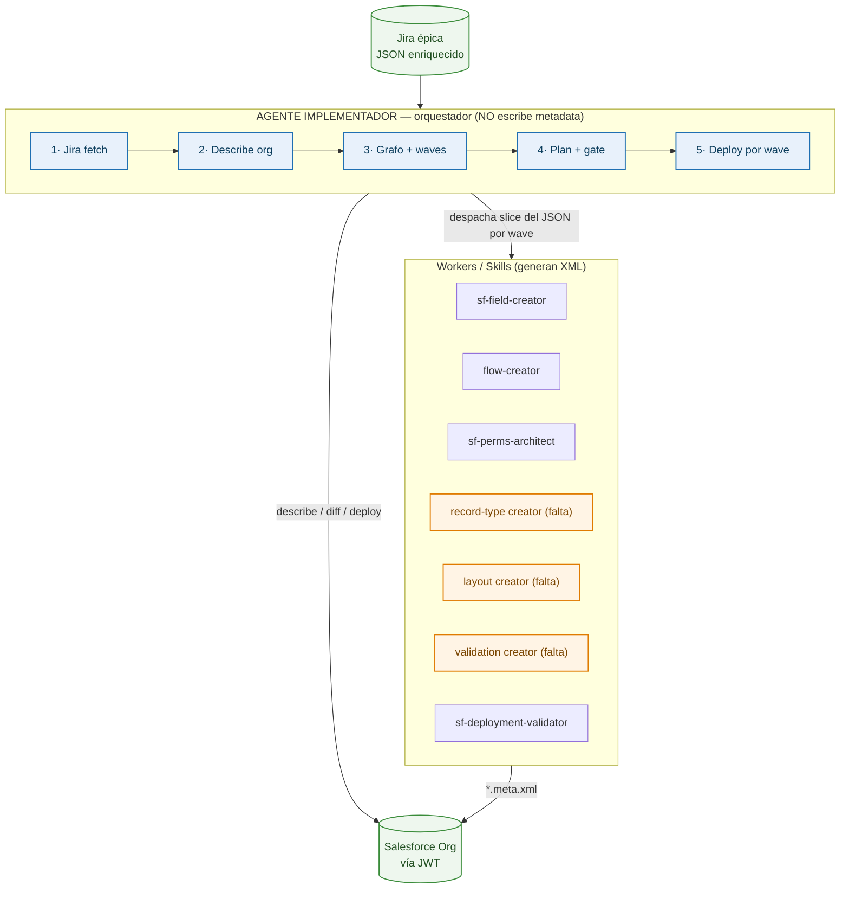
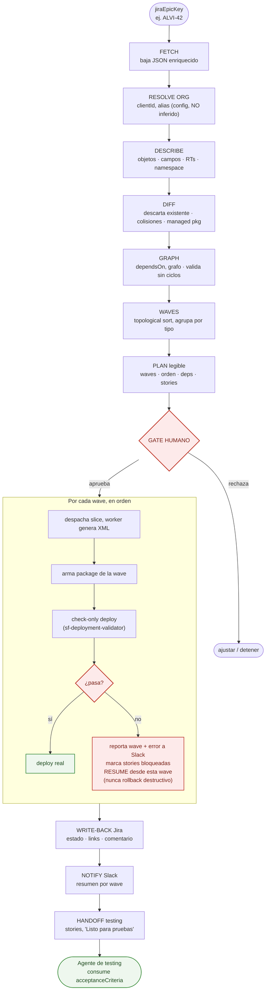
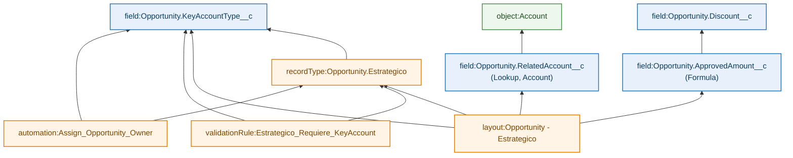

# Agente Implementador Salesforce — Diagramas y diseño

Documento de diseño del agente que toma una épica en Jira (con su JSON enriquecido + prototipos) y la implementa en el org como lo haría un admin/dev, deployando metadata en el orden correcto.

> Los diagramas están en **Mermaid**: GitHub los renderiza solo al abrir este archivo en la web.

---

## 0. Principio rector

**El orden de implementación es determinístico, no es decisión del LLM.**

La dependencia entre metadata de Salesforce es fija y conocida: no hay validation rule sin el campo, ni layout sin el record type, ni flow sin los campos que referencia. Eso se modela como un **grafo de dependencias + topological sort**. El LLM se usa para interpretar el JSON, generar XML, redactar el plan legible y diagnosticar errores de deploy — **no** para decidir secuencia.

---

## 1. Arquitectura — orquestador + workers

El orquestador **no escribe metadata**. Coordina: lee, resuelve dependencias, genera el plan, despacha a los workers, valida (check-only), deploya wave por wave y reporta. Cada skill es un worker que recibe un slice del JSON y devuelve XML.

> En **naranja**, los workers que hoy faltan como pieza independiente: record types + business processes, page layouts completos y validation rules.

---

## 2. Flujo de ejecución end-to-end

Los pasos **DESCRIBE** (4) y **DIFF** (5) son los que más se olvidan y los que más rompen: sin ellos el agente intenta crear cosas que ya existen y el deploy falla o duplica.

---

## 3. Orden canónico de waves (proceso sales)

El topological sort da un orden válido; agrupar en **waves por tipo de metadata** lo hace eficiente (Salesforce deploya atómico por paquete). Dentro de cada wave se respeta el sub-orden del grafo.

```mermaid
flowchart LR
    W0["W0<br/>Global<br/>Value Sets"] --> W1["W1<br/>Custom<br/>Objects"]
    W1 --> W2["W2<br/>Fields<br/>simples"]
    W2 --> W3["W3<br/>Fields calc.<br/>Formula·Rollup"]
    W3 --> W4["W4<br/>Record Types<br/>+ Business Proc."]
    W4 --> W5["W5<br/>Compact<br/>Layouts"]
    W5 --> W6["W6<br/>Page<br/>Layouts"]
    W6 --> W7["W7<br/>Validation<br/>Rules"]
    W7 --> W8["W8<br/>Flows /<br/>Apex"]
    W8 --> W9["W9<br/>Perm Sets<br/>/ PSG"]
    W9 --> W10["W10<br/>Apps /<br/>Tabs"]
    W10 --> W11["W11<br/>Reports /<br/>Dashboards"]

    classDef wave fill:#e8f1fb,stroke:#1f6fb2,color:#0b3d5c,stroke-width:1.5px;
    class W0,W1,W2,W3,W4,W5,W6,W7,W8,W9,W10,W11 wave;
```

> El orden de negocio (Lead → Account → Contact → Opportunity) es el sub-orden **dentro** de la wave de campos, pero **manda siempre la dependencia de lookup/master-detail**. Si una Opportunity tiene lookup a un objeto custom, ese objeto va en W1 sí o sí.

---

## 4. Cómo el grafo decide el orden (ejemplo)

Cada componente declara de qué depende con IDs canónicos (`object:`, `field:`, `recordType:`, `valueSet:`, `automation:`). La automatización que arma el JSON debería **derivar `dependsOn` automáticamente** parseando lookups, fórmulas y referencias de layout/validation.

> La flecha significa **"depende de"**. El topological sort sobre este grafo es lo que produce el orden — determinístico, no decisión del LLM.

---

## 5. Notas de diseño clave

- **Idempotencia**: gracias al paso DIFF, re-correr una épica ya implementada no recrea nada. Re-runs seguros.
- **Fallas por wave**: si una wave falla, **no** hay auto-rollback. Se reporta a Slack, se marcan bloqueadas las stories cuyos `components` están en o después de la wave fallida, y se permite **resume desde la wave fallida**.
- **Nunca destructivo automático**: borrar campos/objetos jamás en automático; si el DIFF detecta una eliminación, se reporta para revisión humana.
- **Namespace / managed packages**: el DESCRIBE detecta namespaces presentes; nunca se genera XML para crear componentes con namespace ajeno ni se incluyen en el `package.xml`.
- **Acceso al org**: Connected App con **JWT Bearer Flow** + usuario de integración dedicado por cliente. El mapeo `clientId → org alias → credenciales` vive en config, nunca lo infiere el agente.
- **Permisos**: permission sets, no perfiles. Todo lo granular en permission sets agrupados en Permission Set Groups por persona. FLS de campo nunca mayor que el CRUD del objeto; formula y roll-up siempre read-only.
- **Handoff a testing**: el puente es `stories[].acceptanceCriteria`. Al terminar las waves de una story sin errores, la tarea pasa a "Listo para pruebas" y el agente de testing la consume.

---

## 6. Checklist — lo que falta definir

**Workers que faltan (gaps en las skills actuales)**
- [ ] Worker de **Record Types + Business Processes**.
- [ ] Worker de **Page Layouts completos** (secciones + asignación por record type).
- [ ] Worker de **Validation Rules**.
- [ ] El **orquestador** (grafo + waves + gate + resume) — es nuevo.

**Inputs / schema**
- [ ] Versionar el schema del JSON (`schemaVersion`) y documentarlo.
- [ ] Que el generador del show comercial **derive `dependsOn` automáticamente**.
- [ ] Catálogo de personas estable por cliente (`clientes/{cliente}/personas.json`).
- [ ] Acordar formato de `acceptanceCriteria` con el agente de testing (¿Gherkin?).

**Infra / operación**
- [ ] Connected App + JWT + usuario de integración por cliente.
- [ ] Config de mapeo `clientId → org alias`.
- [ ] Paso DESCRIBE (introspección) y DIFF (descartar existente / namespace).
- [ ] Lógica de resume por wave + marcado de stories bloqueadas.

---

## Resumen en una línea

Orquestador que lee el JSON enriquecido, **describe el org**, computa un **grafo de dependencias** y deploya en **waves ordenadas por tipo de metadata** vía las skills como workers, con **gate humano antes del deploy**, **resume ante fallas** y **handoff por acceptance criteria** al agente de testing.
